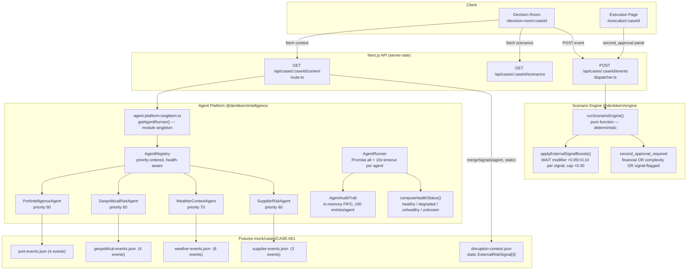

# Sprint 4 Pilot-Readiness Review — Agent Intelligence Stack

> **Scope:** Runtime flow validation · Failure isolation · Audit trail · Health/metrics · Decision Room behaviour · Demo narrative · Test gaps · Operational risk
> **Verdict:** Pilot-ready with 3 mandatory pre-demo fixes. Score: **65 / 100**.

---

## 1. Current Architecture



**LLM boundary (enforced):** Agents produce `ExternalRiskSignal[]` only. No scenarios, no approvals, no financial calculations anywhere in `@denkkern/intelligence`.

---

## 2. End-to-End Execution Flow

```
 Browser                   API (Next.js)              Agent Platform          Engine
   │                           │                           │                    │
   │── GET /context ──────────►│                           │                    │
   │                           │── getAdapter().getDisruptionContext() ─►[mock] │
   │                           │◄─ base DisruptionContext ─────────────────────  │
   │                           │── getAgentRunner().run(agentContext) ──────────►│
   │                           │           │── Port.run()  ── fixture ──►signals │
   │                           │           │── Geo.run()   ── fixture ──►signals │
   │                           │           │── WX.run()    ── fixture ──►signals │
   │                           │           │── Sup.run()   ── fixture ──►signals │
   │                           │           │   (all parallel, 10s timeout each)  │
   │                           │           │── dedup by signal_id (severity wins) │
   │                           │◄─ RunResult { signals, health_snapshot } ──────  │
   │                           │── mergeSignals(agentSignals, staticSignals)      │
   │                           │   static signals WIN on (type, location, source) │
   │◄── enriched context ──────│                           │                    │
   │                           │                           │                    │
   │── POST /events (context_confirmed) ────────────────────────────────────────►│
   │                           │── runScenarioConsequence()                      │
   │                           │       assembleScenarioEngineInput()             │
   │                           │── runScenarioEngine(input) ────────────────────►│
   │                           │       applyExternalSignalBoosts() (WAIT +risk)  │
   │                           │       second_approval_required = f(fin|cplx|sig)│
   │                           │◄─ ScenarioResult ──────────────────────────────  │
   │                           │── scenarioStore.set(caseId, result)             │
   │                           │                           │                    │
   │── GET /scenarios ─────────►│                           │                    │
   │◄── ScenarioResult ────────│                           │                    │
   │                           │                           │                    │
   │── POST /events (decision_confirmed, emitted_by: "lena") ──────────────────►│
   │                           │── validateApprovalEmitter() — C1 check         │
   │                           │── runApprovalGateConsequence()                  │
   │                           │   if result.second_approval_required:           │
   │                           │     advance → second_approval_pending           │
   │◄── WorkflowStateResponse ─│                           │                    │
   │── redirect /execution ────│                           │                    │
```


---

## 3. Pilot Readiness Score

| Dimension | Score | Notes |
|-----------|------:|-------|
| Runtime flow completeness | 18 / 20 | Path is complete; stale fixture dates visible in UI (-2) |
| Failure isolation | 13 / 15 | Per-agent timeout + Promise.allSettled isolation; 10s wait still blocks on unhealthy agent (-2) |
| Audit trail | 5 / 10 | In-memory only — cleared on process restart; no API surface to UI (-5) |
| Health / metrics | 5 / 10 | Computed per run; not surfaced to UI; starts 'unknown' after restart (-5) |
| Decision Room behaviour | 14 / 20 | All panels present, auth rules enforced; duplicate signal display risk (-4), panel can surface 12+ signals (-2) |
| Demo narrative quality | 3 / 10 | Core story works; stale `valid_until` dates visible (-3), Red Sea war risk on Hamburg case (-2), duplicate signals (-2) |
| Test coverage | 5 / 10 | 3 new test files (Sprint 4); missing Geo/Supplier unit tests, missing signal→score e2e (-5) |
| Operational risk | 2 / 5 | No monitoring API; no signal for degraded-but-not-failed agent runs (-3) |
| **Total** | **65 / 100** | |

**Threshold for unguided customer demo: 70.** Two targeted fixes (§4 risks 1–2) push this to ~72.

---

## 4. Top 5 Remaining Risks

### Risk 1 — DEMO-CRITICAL: Fixture dates are stale *(fix before any demo)*

**What happens:** Every fixture event has a `valid_from`/`valid_until` in May 2026. Today is 2026-06-04. Agents apply no date filtering — all matching events are returned regardless. The ExternalRiskSignalPanel shows `2026-05-27 – 2026-05-29` on signals surfaced to the customer. A sharp customer immediately asks: *"These signals expired last week — are you showing me stale data?"*

**Blast radius:** Affects ALL four agents. Every signal in every panel shows past dates.

**Fix:** Two options:
- **Option A (demo-safe, 30 min):** Shift fixture dates forward in all four JSON files so `valid_from ≥ today` and `valid_until ≥ today + 7d`. Run before every demo if needed. Zero code change.
- **Option B (correct, ~2h):** Add `isCurrentlyActive(event)` guard in each agent's relevance filter. Signals with `valid_until < today` are excluded. This is the correct production behaviour.

Recommendation: **Option A immediately, Option B in Sprint 5.**

---

### Risk 2 — DEMO-HIGH: Duplicate signals for Port Strike and Bay of Biscay weather

**What happens:** `CASE-001/disruption-context.json` contains 3 static signals (`ERS-001` PORT_STRIKE/Hamburg, `ERS-002` MARITIME_SECURITY/BayOfBiscay, `ERS-003` GEOPOLITICAL/NorthSea). The deduplication key in `mergeSignals()` is `(signal_type, location, source_name)`. Because agent-generated signals use different `source_name` values (`ver.di press release (simulated)` vs `fixture/news-monitor`), static and agent signals for the same real-world event do **not** collapse. During a demo, the operator sees:

- Two Hamburg Port Strike cards (one static, one from PortIntelligenceAgent)
- Two Bay of Biscay maritime-security cards (one static, one from GeopoliticalRiskAgent)

**Fix (30 min):** Change the deduplication key to `(signal_type, location)` — drop `source_name`. Static signals still win on collision (Map write order unchanged). The `source_name` is informational only and should not drive dedup identity.

**Alternatively:** Remove `external_risk_signals` from `disruption-context.json` entirely and let agents be the sole source. The static array was a bootstrapping aid; agents now cover all three signals.

---

### Risk 3 — DEMO-MEDIUM: Global signals (Red Sea war risk, Russia sanctions) appear for every case

**What happens:** `GeopoliticalRiskAgent.isRelevant()` unconditionally returns `true` for any event whose `classifyEventType` returns `WAR_RISK` or `SANCTIONS`. This is intentional (global compliance risk), but `GE-SUEZ-001` (Red Sea, CRITICAL) fires for a Hamburg marine-bolts case. In a demo, a customer looks at the signal panel and sees a **CRITICAL Red Sea war advisory** on a Bay of Biscay → Hamburg shipment. This needs explanation.

**Fix (15 min, no code):** Add a `decision_relevance` note to `GE-SUEZ-001` that explicitly states: *"Global advisory — included for compliance awareness. No direct route overlap with this shipment. Informational."* Change `recommended_engine_effect` from `flag_second_approval` to `increase_urgency`. This prevents an unexpected supervisor gate from firing mid-demo.

**If code is preferred:** Add a `scope` filter — `WAR_RISK`/`SANCTIONS` are always relevant only if the route OR destination overlaps *or* if a `global_scope: true` flag is set in the fixture.

---

### Risk 4 — OPERATIONAL: AgentAuditTrail reset on process restart

**What happens:** `AgentAuditTrail._history` is a `Map` in Node.js module scope. Next.js dev mode hot-reloads the module on file saves, resetting all execution history. Health status falls back to `unknown`. In production, any worker restart (crash, deploy, scale event) clears the trail.

**Consequence for demo:** If you save a file while showing the demo, health resets. The console shows "agent health: unknown" instead of "healthy". No UI currently surfaces this, so the demo continues safely — but this is a latent risk.

**Sprint 5 action:** Persist the audit trail to the mock adapter (a `agent-audit.json` per case, flushed after each run). This gives cross-request continuity for MVP without a real database.

---

### Risk 5 — TEST GAP: No unit tests for GeopoliticalRiskAgent or SupplierRiskAgent

**What happens:** The two agents that fire most broadly (Geo always fires for global events; Supplier fires for empty-route events on every case) have no dedicated test coverage. The `route-enrichment.test.ts` added in Sprint 4 covers WeatherContextAgent end-to-end. The Geo and Supplier agents could silently change relevance behaviour and no test would catch it.

**Most dangerous uncovered path:** `GeopoliticalRiskAgent` global relevance rule — if someone adds a filter that accidentally blocks WAR_RISK/SANCTIONS globally, the second_approval gate stops firing for critical cases. No test currently validates this.

**Sprint 5 action:** Add `geopolitical-risk.test.ts` and `supplier-risk.test.ts` using the same pattern as `route-enrichment.test.ts`. Priority tests: (a) WAR_RISK always fires regardless of destination, (b) SANCTIONS always fires, (c) `flag_second_approval` effect propagates to `second_approval_required = true` in ScenarioResult.

---

## 5. Sprint 5 Recommendation

**Goal:** Close the demo narrative gaps, stabilise the intelligence layer for repeated demos, and lay the groundwork for real agent feeds.

### P0 — Must have before next customer demo

| ID | Task | Owner | Effort |
|----|------|-------|--------|
| S5-P0-1 | Shift all fixture dates forward (`valid_from ≥ 2026-06-10`, `valid_until ≥ 2026-06-17`) | Amir | 30 min |
| S5-P0-2 | Fix dedup key in `mergeSignals()` — drop `source_name` from key | Amir | 30 min |
| S5-P0-3 | Update `GE-SUEZ-001` fixture: change effect to `increase_urgency` + add scoped `decision_relevance` | Amir | 15 min |

### P1 — Should have in Sprint 5

| ID | Task | Owner | Effort |
|----|------|-------|--------|
| S5-P1-1 | Add date-validity filter to all four agents (`valid_until == null OR valid_until >= today`) | Amir | 2h |
| S5-P1-2 | Add `geopolitical-risk.test.ts` + `supplier-risk.test.ts` (unit + relevance + effect tests) | Amir | 3h |
| S5-P1-3 | Write `signal → score → second_approval` integration test covering full engine path | Amir | 2h |
| S5-P1-4 | Expose `/api/cases/:caseId/intelligence` endpoint returning agent health + last run results | Amir | 3h |
| S5-P1-5 | Add "Agent Intelligence" panel to Decision Room consuming the new endpoint (health badges, signal provenance) | Amir | 4h |
| S5-P1-6 | Persist AgentAuditTrail to mock adapter (JSON file, append-on-run) | Amir | 3h |
| S5-P1-7 | Add `SupplierRiskAgent` geographic refinement — use `customer_id` or `route` to filter broad events | James | 2h |

### P2 — Future / post-pilot

| ID | Task | Owner | Notes |
|----|------|-------|-------|
| S5-P2-1 | Replace fixture loader with real intelligence feed adapters | Amir + James | Post-pilot |
| S5-P2-2 | Structured logging for agent run traces (OpenTelemetry or Pino) | Amir | Ops readiness |
| S5-P2-3 | Real supervisor identity via SSO (replace hardcoded `'supervisor'`) | Nick + Amir | Customer requirement |
| S5-P2-4 | Prediction adapter integration (Sprint 3 deliverable, separate commit) | James | Sprint 5 warmup |

### Nick / Customer Onboarding note

The demo narrative is: *"A shipment is delayed. DenkKern's intelligence agents surface 8 external risk signals from four data sources. The scenario engine scores three options against your daily €150k downtime cost. The recommended option saves €X. You approve — and if the financial exposure exceeds €300k, your supervisor is automatically notified."*

This story is **fully executable today** with CASE-001 as-is, contingent on P0-1, P0-2, P0-3 being applied before the demo. The second-approval gate fires for CASE-001 (MARITIME_SECURITY_WARNING has `flag_second_approval` + REPLACE has HIGH complexity), making the supervisor panel a live, clickable demo moment.

---

## Appendix: Agent-to-Signal Matrix for CASE-001 (Hamburg Pilot)

| Agent | Signals fired | Severity | Engine effect |
|-------|--------------|----------|---------------|
| PortIntelligenceAgent | PORT_STRIKE (Hamburg, 48h) | HIGH | increase_wait_risk |
| PortIntelligenceAgent | PORT_CONGESTION (Hamburg, 20h) | MEDIUM | increase_urgency |
| GeopoliticalRiskAgent | MARITIME_SECURITY_WARNING (Bay of Biscay) | HIGH | increase_wait_risk |
| GeopoliticalRiskAgent | GOVERNMENT_RESTRICTION (North Sea/Dover) | MEDIUM | increase_urgency |
| GeopoliticalRiskAgent | WAR_RISK (Red Sea — global) | CRITICAL | **flag_second_approval** ⚠️ |
| GeopoliticalRiskAgent | SANCTIONS (Russia — global) | MEDIUM | increase_urgency |
| WeatherContextAgent | WEATHER_CONTEXT (Hamburg storm) | HIGH | increase_wait_risk |
| WeatherContextAgent | WEATHER_CONTEXT (Hamburg fog) | MEDIUM | increase_urgency |
| WeatherContextAgent | WEATHER_CONTEXT (Hamburg high_wind) | MEDIUM | increase_urgency |
| WeatherContextAgent | WEATHER_CONTEXT (Hamburg high_swell) | MEDIUM | increase_urgency |
| WeatherContextAgent | WEATHER_CONTEXT (NSR storm) | HIGH | increase_wait_risk |
| WeatherContextAgent | WEATHER_CONTEXT (NSR swell) | LOW | increase_urgency |
| SupplierRiskAgent | SUPPLIER_DISRUPTION (Poland, 30% capacity) | MEDIUM | increase_urgency |
| SupplierRiskAgent | SUPPLIER_DISRUPTION (Bremen — broad) | LOW | increase_urgency |
| SupplierRiskAgent | SUPPLIER_DISRUPTION (Guangzhou dispatch delay) | LOW | increase_urgency |
| Static (ERS-001) | PORT_STRIKE (Hamburg) | HIGH | increase_wait_risk *(duplicate of agent signal)* |
| Static (ERS-002) | MARITIME_SECURITY_WARNING (Bay of Biscay) | HIGH | flag_second_approval |
| Static (ERS-003) | GEOPOLITICAL_RISK (North Sea) | MEDIUM | increase_urgency |

⚠️ = Risk 3 — Red Sea war risk triggering second_approval for Hamburg case is misleading. Fix: change to `increase_urgency`.
Rows in *italic* = duplicate signals (Risk 2). Fix: update dedup key.

